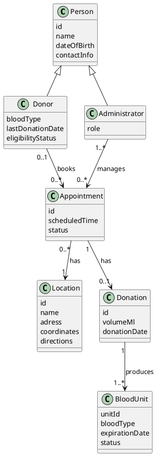

```plantuml
@startuml
class Person {
  id
  name
  dateOfBirth
  contactInfo
}

class Donor extends Person {
  bloodType
  lastDonationDate
  eligibilityStatus
}

class Administrator extends Person {
  role
}

Donor "0..1" --> "0..*" Appointment : books
Administrator "1..*" --> "0..*" Appointment : manages

class Appointment {
  id
  scheduledTime
  status
}

Appointment "0..*" --> "1" Location : has

class Location {
  id
  name
  adress
  coordinates
  directions
}

class Donation {
  id
  volumeMl
  donationDate
}

Appointment "1" --> "0..1" Donation : has

class BloodUnit {
  unitId
  bloodType
  expirationDate
  status
}

Donation "1" --> "1..*" BloodUnit : produces

@enduml
```
