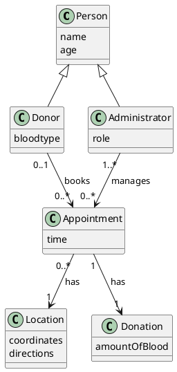

```plantuml
@startuml
class Person {
  name
  age
}

class Donor extends Person {
  bloodtype
}

class Administrator extends Person {
  role
}

Donor "0..1" --> "0..*" Appointment : books
Administrator "1..*" --> "0..*" Appointment : manages

class Appointment {
  time
}

Appointment "0..*" --> "1" Location : has

class Location {
  coordinates
  directions
}

class Donation {
  amountOfBlood
}

Appointment "1" --> "1" Donation : has

@enduml
```
