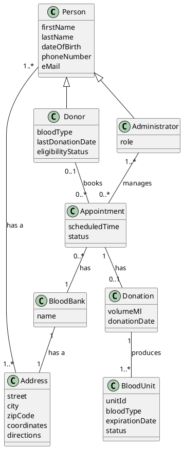

```plantuml
@startuml
class Person {
  firstName
  lastName
  dateOfBirth
  phoneNumber
  eMail
}

Person "1..*" -- "1..*" Address : has a

class Donor extends Person {
  bloodType
  lastDonationDate
  eligibilityStatus
}

class Administrator extends Person {
  role
}

Donor "0..1" -- "0..*" Appointment : books
Administrator "1..*" -- "0..*" Appointment : manages

class Appointment {
  scheduledTime
  status
}

Appointment "0..*" -- "1" BloodBank : has

class BloodBank {
  name  
}

class Address {
  street
  city
  zipCode
  coordinates
  directions
}

BloodBank "1" -- "1" Address : has a

class Donation {
  volumeMl
  donationDate
}

Appointment "1" -- "0..1" Donation : has

class BloodUnit {
  unitId
  bloodType
  expirationDate
  status
}

Donation "1" -- "1..*" BloodUnit : produces
@enduml
```
