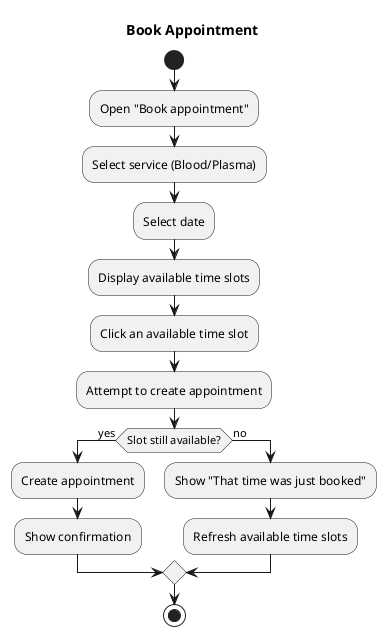

```plantuml
@startuml
title Book Appointment

start
:Open "Book appointment";
:Select service (Blood/Plasma);
:Select date;
:Display available time slots;
:Click an available time slot;
:Attempt to create appointment;

if (Slot still available?) then (yes)
  :Create appointment;
  :Show confirmation;
else (no)
  :Show "That time was just booked";
  :Refresh available time slots;
endif
stop

@enduml
```
