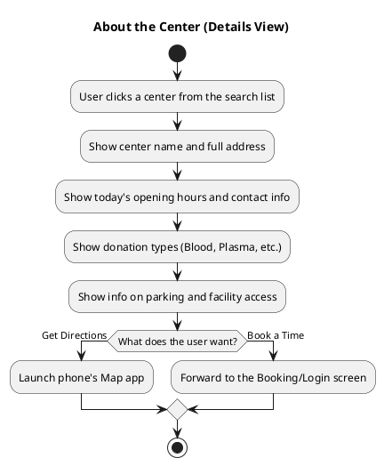

```plantuml
@startuml
title About the Center (Details View)

start

:User clicks a center from the search list;

:Show center name and full address;
:Show today's opening hours and contact info;

:Show donation types (Blood, Plasma, etc.);
:Show info on parking and facility access;

if (What does the user want?) then (Get Directions)
  :Launch phone's Map app;
else (Book a Time)
  :Forward to the Booking/Login screen;
endif

stop
@enduml
```
