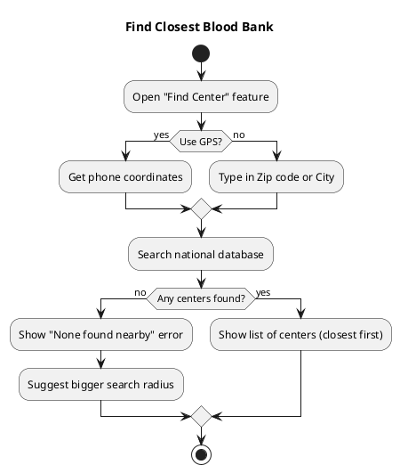

```plantuml
@startuml
title Find Closest Blood Bank

start

:Open "Find Center" feature;

if (Use GPS?) then (yes)
  :Get phone coordinates;
else (no)
  :Type in Zip code or City;
endif

:Search national database;

if (Any centers found?) then (no)
  :Show "None found nearby" error;
  :Suggest bigger search radius;
else (yes)
  :Show list of centers (closest first);
endif

stop
@enduml
```
