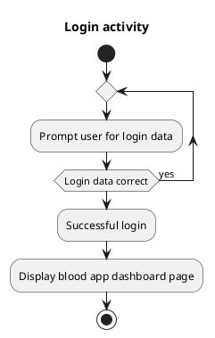

```plantuml
@startuml
title Login activity

start
repeat
  :Prompt user for login data;
repeat while (Login data correct) is (yes)
:Successful login;
:Display blood app dashboard page;
stop
@enduml
```
