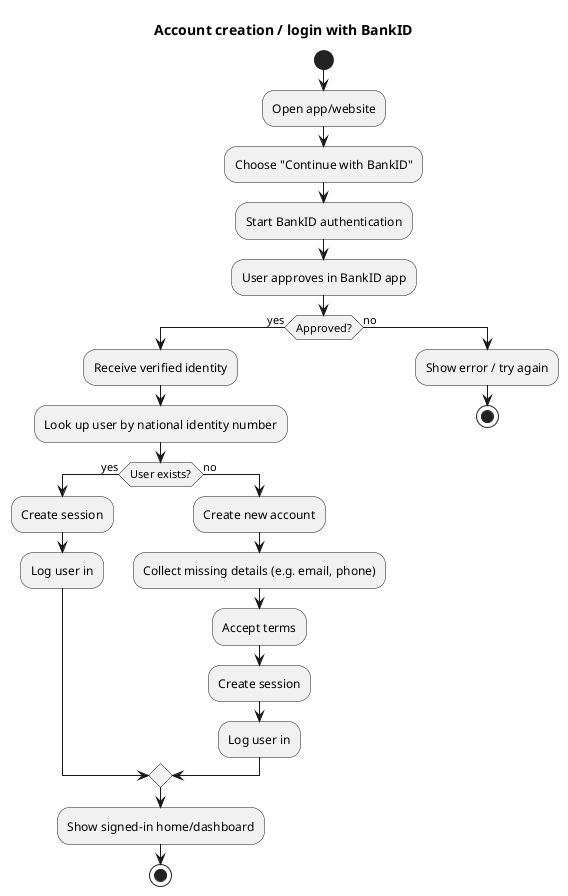

```plantuml
@startuml
title Account creation / login with BankID

start
:Open app/website;
:Choose "Continue with BankID";
:Start BankID authentication;
:User approves in BankID app;

if (Approved?) then (yes)
  :Receive verified identity;
  :Look up user by national identity number;

  if (User exists?) then (yes)
    :Create session;
    :Log user in;
  else (no)
    :Create new account;
    :Collect missing details (e.g. email, phone);
    :Accept terms;
    :Create session;
    :Log user in;
  endif

  :Show signed-in home/dashboard;
  stop
else (no)
  :Show error / try again;
  stop
endif

@enduml
```
