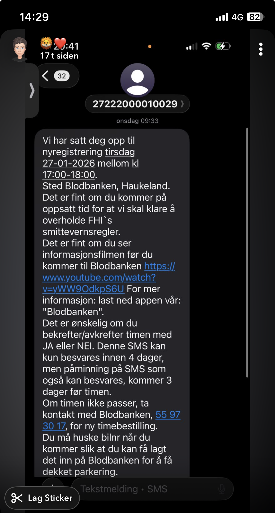

# DAT251 group meeting on Wednesday 2026-01-27

The group met at HVL from 14:00-16:00. All members were present.

Summary:
- Sara has booked two interviews tomorrow, one today. Gonna try to talk to staff at blood bank too
- Supervision w/ Rogart today from 15:15. Goal seems to be confirming the idea, not much about the work so far
- Dragos presenting the beginnings of a persona
- Continuing work on interview prep and personas

## Details about booking confirmation

- Confirmation received by text message:
  - Free parking
  - Time off work (velferdspermisjon, employer dependent)
  - Practical information youtube video: https://www.youtube.com/watch?v=yWW9OdkpS6U
  - More information: blodbanken app, and [website](https://www.blodbanken-bergen.no/index.php?action=chapter&chapter=f9MzigMM)

## Feedback from Rogart

Comments:
- Final report is the graded one. Supervision and intermediate assignments is for support.
- Absolutely sufficient to have a MVP that does a better job than current solutions, not actually integrating it with the hospitals.
- Scheduling is the natural algorithm. Objects are people, places, etc.
- Teamwork is the most important in the beginning.
- Exam (+its papers) mostly based on what we do in the papers
- Chat with Helse Vest IKT (Kronstad X)
- Other sources of data than interview: survey?

- Q: Validation of the project idea
- A: Seems good. See comments.

- Q: Ideas for interview questions
- A: Not brought up

- Q: Business requirements (particularly business canvas) -- this is likely not a profitable idea...
- A: What will happen with it later? Other people taking it over? Cost: hours of work. Revenue: ...
